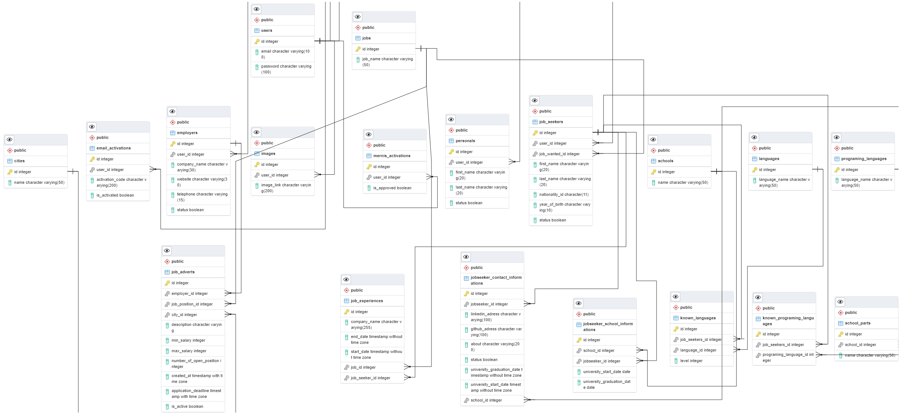

[![Contributors][contributors-shield]][contributors-url]
[![Forks][forks-shield]][forks-url]
[![Stargazers][stars-shield]][stars-url]
[![Issues][issues-shield]][issues-url]
[![LinkedIn][linkedin-shield]][linkedin-url]

 

  
  <h2 align="center">HRMS Project</h2>
  

    Human Resource Management System with Spring Boot and PostgreSql    
  

 
 
    

    Coming Soon.
    

## Model

[contributors-shield]: https://img.shields.io/github/contributors/semihshn/RentaCar-Back-end.svg?style=for-the-badge
[contributors-url]: https://github.com/semihshn/RentaCar-Back-end/graphs/contributors
[forks-shield]: https://img.shields.io/github/forks/semihshn/RentaCar-Back-end.svg?style=for-the-badge
[forks-url]: https://github.com/semihshn/RentaCar-Back-end/network/members
[stars-shield]: https://img.shields.io/github/stars/semihshn/RentaCar-Back-end.svg?style=for-the-badge
[stars-url]: https://github.com/semihshn/RentaCar-Back-end/stargazers
[issues-shield]: https://img.shields.io/github/issues/semihshn/RentaCar-Back-end.svg?style=for-the-badge
[issues-url]: https://github.com/semihshn/RentaCar-Back-end/issues
[license-shield]: https://img.shields.io/github/license/semihshn/RentaCar-Back-end.svg?style=for-the-badge
[license-url]: https://github.com/semihshn/RentaCar-Back-end
[linkedin-shield]: https://img.shields.io/badge/-LinkedIn-black.svg?style=for-the-badge&logo=linkedin&colorB=555
[linkedin-url]: https://www.linkedin.com/in/semih-%C5%9Fahan-8a7627176/

 

